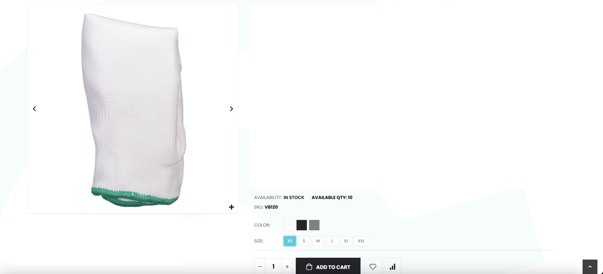

### Stock Availability Count Display on Product Details Page

Enhance your Magento store's product pages by displaying real-time stock counts for customers. This extension shows the available quantity of both simple and configurable (variable) products directly on the product details page, helping customers make informed purchasing decisions and reducing cart abandonment due to unexpected stock shortages.
#### Demo:

##### Simple Product Page

##### Configurable Product Page


## Installation via composer


```
composer require corals/m2-stock-qty
php bin/magento setup:upgrade
php bin/magento setup:static-content:deploy
php bin/magento cache:flush
```

After installing the module, please go to Store -> Configuration -> Corals Extension -> Stock Qty to enable/disable the function
